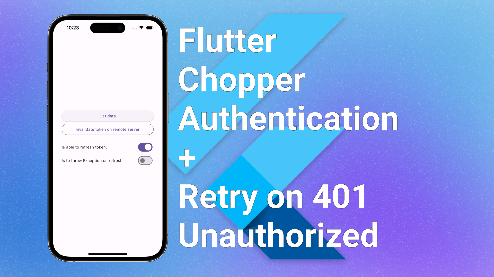

# Flutter Chopper authentication example with retry on 401 Unauthorized

How to add an HTTP Authorization header to the Chopper requests using interceptor and how to refresh token and retry requests in case of 401 Unauthorized response.

**[⭐️ Article on Medium](https://medium.com/@alexandersnotes/flutter-chopper-authentication-retry-on-401-unauthorized-e0128fb0a7d)**

## Files navigation

- [main.dart](lib/main.dart) - basic UI.
- [chopper.dart](lib/chopper.dart) - Chopper client, auth header interceptor, and Authenticator for retry on 401 (Unauthorized).
- [auth_repository.dart](lib/auth_repository.dart) - repository with an access token and fake remote server to emulate the access token invalidation.

---

Flutter version: 3.13.0
